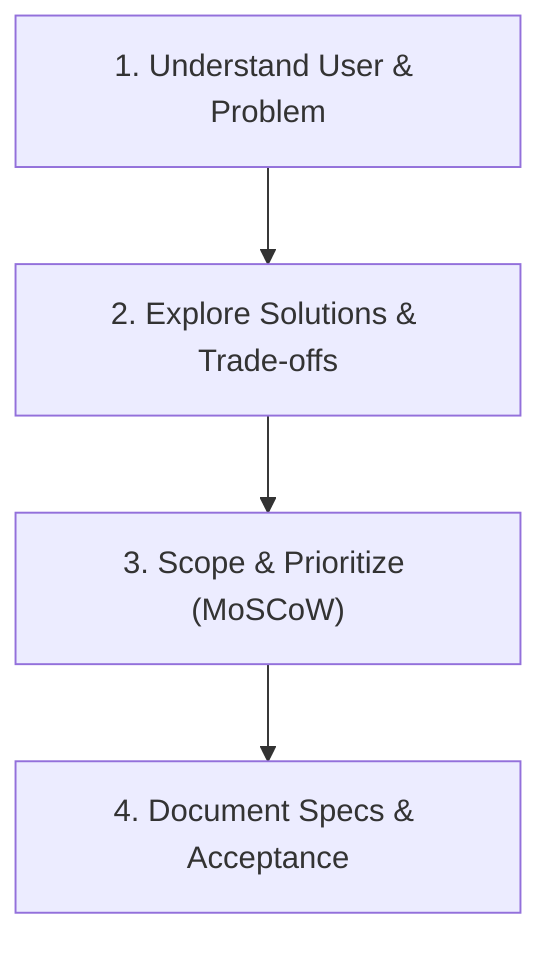

# Brainstorming & Product Discovery

Brainstorming ensures that time is invested in building the right solution rather than fixing rushed mistakes.

---

## The 4 Brainstorming Phases

---

## Phase 1: Problem Definition & Personas
1. **Target User**: Who is using this product? What is their technical literacy and primary pain point?
2. **Core Value Proposition**: What is the single most important action the user must achieve in under 60 seconds?
3. **Key Success Metric**: How do we measure success (e.g., conversion rate, render speed, zero-setup onboarding)?

---

## Phase 2: Technical Architecture Exploration
Always formulate and compare at least two architectural directions:

- **Approach A (Lightweight & Rapid)**:
  - Stack: React + Vite + Vanilla CSS / Tailwind + LocalStorage / SQLite.
  - Pros: Instant setup, zero backend maintenance, cheap hosting.
  - Cons: Limited multi-device sync, client-side resource constraints.
- **Approach B (Full-Stack & Extensible)**:
  - Stack: Next.js / Fastify + PostgreSQL (Neon/Supabase) + Prisma/Drizzle.
  - Pros: Scalable data modeling, server-side caching, secure auth.
  - Cons: Higher infrastructure complexity, migration overhead.

---

## Phase 3: Scope Prioritization (MoSCoW)
- **Must Have (P0 - MVP)**: Non-negotiable core features required to prove value.
- **Should Have (P1)**: High-value features deferred to post-MVP launch.
- **Could Have (P2)**: Nice-to-have visual polish, extras, advanced exports.
- **Won't Have (P3)**: Explicitly excluded from this phase to prevent scope creep.

---

## Phase 4: Output PRD Summary
Produce a concise Product Requirements Document (PRD) with:
1. Feature list with acceptance criteria.
2. User flow diagram.
3. API / Data contract draft.
