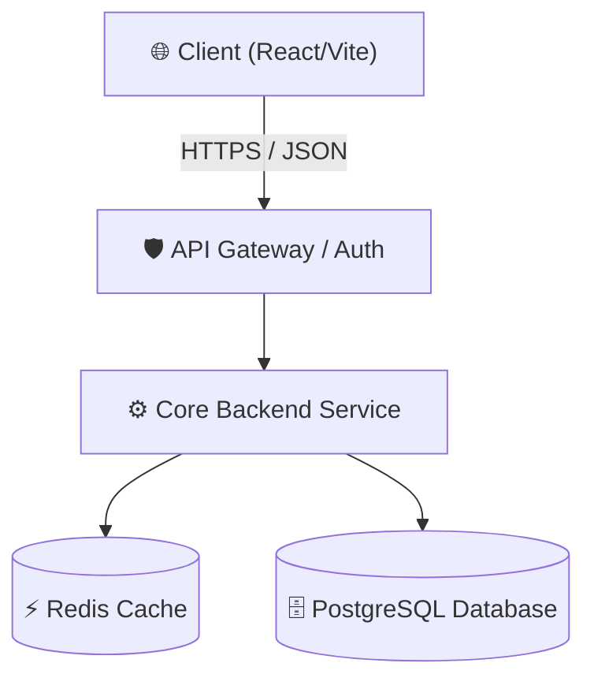
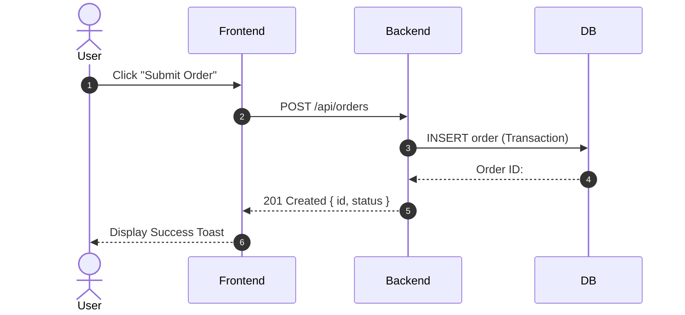

# Excalidraw & System Architecture Diagramming

A great diagram communicates complex architectures in seconds. Use visual hierarchy, consistent color layers, and clear data flows.

---

## 1. Architectural Color Layering

When diagramming systems or wireframes, use standardized semantic colors:

| Layer | Semantic Role | Excalidraw / Hex Color |
| :--- | :--- | :--- |
| **Client / Frontend** | Web App, Mobile App, Browser | `#3B82F6` (Blue) / `#06B6D4` (Cyan) |
| **API Gateway / Proxy** | Reverse Proxy, Rate Limiter, Auth | `#6366F1` (Indigo) |
| **Services / Workers** | Business Logic, Background Jobs | `#8B5CF6` (Purple) |
| **Database & Cache** | PostgreSQL, Redis, Storage | `#10B981` (Emerald) |
| **External Integrations** | Stripe, SendGrid, AI APIs | `#F59E0B` (Amber) |

---

## 2. Mermaid Diagram Formats

Antigravity natively renders Mermaid diagrams in markdown artifacts. Use these standard formats:

### System Architecture Flowchart

### Sequence Diagram

