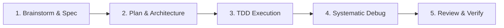

# Superpowers Engineering Workflow

Superpowers transforms the AI agent from a casual code generator into a disciplined technical co-founder. It enforces rigorous software engineering principles, ensuring that solutions are well-architected, thoroughly tested, and production-ready.

---

## The 5 Core Disciplines

---

## Discipline 1: Brainstorming & Specification
**Never write production code until requirements and design are crystal clear.**

1. **Socratic Inquiry**: Ask clarifying questions to surface unstated assumptions, scale expectations, and non-functional requirements.
2. **Explore Alternatives**: Propose at least 2 architectural approaches with trade-offs (simplicity vs. extensibility, performance vs. build time).
3. **Define Scope**: Clearly distinguish what is in scope for the MVP versus what is deferred to future iterations.
4. **Draft Specification**:
   - User stories & acceptance criteria.
   - Data models & API contracts.
   - Edge cases & failure modes.

---

## Discipline 2: Structured Planning
**Break complex tasks into small, verifiable, bite-sized steps.**

1. **Step-by-Step Task Breakdown**:
   - Each task should take less than 15-30 minutes of focused effort.
   - Tasks must have clear preconditions and verification steps.
2. **Explicit Verification Criteria**: Define how each task is verified (e.g., automated test passes, CLI command output matches expected JSON, browser renders correctly).
3. **Isolate Changes**: When applicable, use Git branches or worktrees to keep work modular and easily reversible.

---

## Discipline 3: Test-Driven Development (TDD)
**Code without tests is legacy code. Follow the Red-Green-Refactor cycle.**

1. **Red**: Write an automated test that defines the desired functionality. Run it and verify that it **fails for the expected reason**.
2. **Green**: Write the minimal code necessary to make the test pass. Do not add speculative features.
3. **Refactor**: Clean up the code, improve variable naming, remove duplication, and optimize while keeping all tests green.
4. **Test Boundaries**: Always include tests for:
   - Happy path.
   - Invalid or empty inputs.
   - Boundary values (0, -1, max integers, long strings).
   - Network failure or timeout handling.

---

## Discipline 4: Systematic Debugging
**Do not guess or apply random fixes. Diagnose scientifically.**

1. **Reproduce**: Create a minimal reproducible example or automated failing test case.
2. **Hypothesize**: Formulate a clear hypothesis about the root cause based on error logs and call stacks.
3. **Isolate**: Inspect state and narrow down the faulty component or line of code.
4. **Fix Minimally**: Apply the simplest fix that directly addresses the root cause.
5. **Verify**: Ensure the reproduction test passes and no regressions were introduced across the test suite.

---

## Discipline 5: Review & Verification Before Completion
**Never consider a task complete without rigorous verification.**

1. **Run Full Test Suite**: Execute all unit, integration, and linting checks.
2. **Code Hygiene Review**:
   - No commented-out dead code or temporary debugging `console.log` / `print` statements.
   - Types are strictly defined (no unnecessary `any` in TypeScript).
   - Error messages are actionable and clear.
3. **Documentation**: Update README, inline docstrings, and environment variable examples (`.env.example`).
