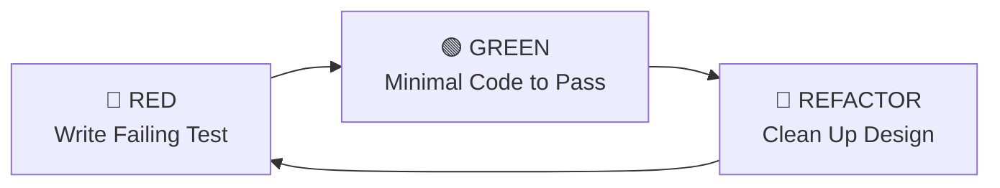

# Strict Test-Driven Development (TDD)

TDD is a non-negotiable engineering discipline. Code written without failing tests first carries high risk of regression, hidden bugs, and design flaws.

---

## The Red-Green-Refactor Cycle

---

## Step 1: Red (Write the Failing Test)
1. Write a focused test specifying observable behavior.
2. Execute the test runner (e.g., `npm test` or `npx vitest run`).
3. **Verify the failure**:
   - The test MUST fail.
   - The failure reason MUST match what you expect (e.g., "function undefined" or "received 0, expected 42").
   - If the test passes immediately, your test is invalid or redundant.

---

## Step 2: Green (Write Minimal Code)
1. Write the simplest possible implementation that satisfies the test.
2. Do not write anticipatory code or extra features not covered by tests.
3. Run the test suite: **all tests must pass**.

---

## Step 3: Refactor (Polish Design)
1. Improve naming, extract helper methods, remove duplication.
2. Tighten TypeScript types (discriminated unions, immutable data structures).
3. Re-run tests after every minor refactor to ensure no regressions.

---

## Edge Case Matrix Checklist
Every feature test file should cover:
- [ ] **Standard Success Path**: Expected inputs produce expected outputs.
- [ ] **Empty / Zero Inputs**: `[]`, `""`, `0`, `null`, `undefined`.
- [ ] **Boundary Conditions**: Maximum array size, negative numbers, long strings.
- [ ] **Error & Exception Paths**: Network drop, timeout, invalid schema validation.
